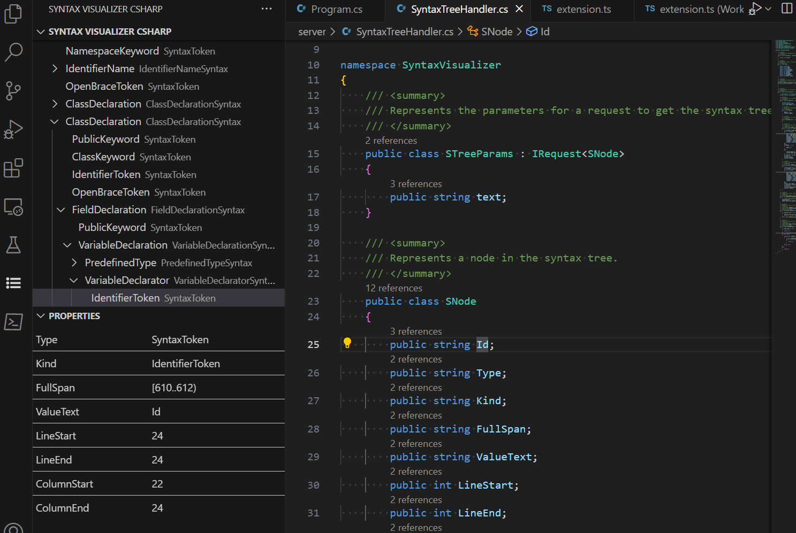

# Into

It is just small extension to learn the process of developing extension for VSC.

# Idea

Make a simpler version of [Syntax visualizer from Visual Studio](https://github.com/dotnet/docs/blob/master/docs/csharp/roslyn-sdk/syntax-visualizer.md)

# Example

